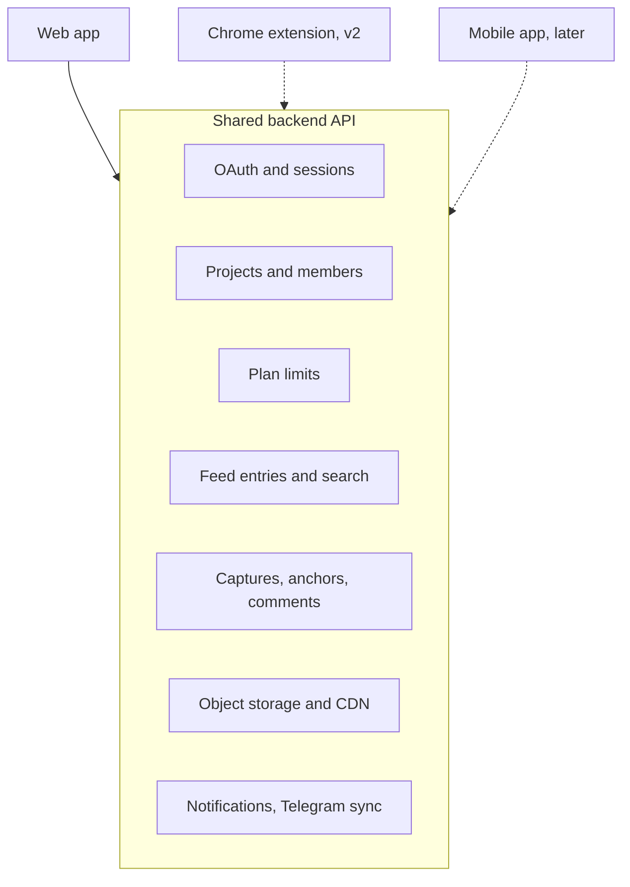
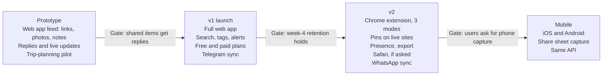

# Kasa — PRD (draft)

Exported 2026-09-26 from the Claude Doc "Kasa — PRD (draft)" by Petr. Edited in the repo on 2026-09-27 to move the Chrome extension from v1 to v2 (PLAN.md D-158 to D-161), so this file is now ahead of the Claude Doc. Update the Doc from this file before exporting it again.

## TL;DR

Kasa is a web app where a small group collects ideas from around the web, whether for a trip, a wedding, a talk, or design inspiration, and discusses them in context. You paste a link, drop a photo, or write a note, and it lands in a project feed that only that project's members can see. A Chrome extension for commenting and drawing directly on any website follows in v2.

**Name.** Kasa comes from Finnish, where it means "pile": a heap of things gathered in one place.

**Problem.** When a group plans something together, the ideas end up scattered: links in a group chat, screenshots in camera rolls, bookmarks nobody shares. The context gets lost. A screenshot of a hotel page doesn't say which room you liked or why, and the discussion gets buried under other messages.

**Bet.** If saving something from the web into a shared space is as easy as sending it to a chat, and it lands as a tidy object the group can discuss, groups will collect more and decide faster. In v2, the extension lets people point at exactly what they mean on the page itself.

## Goals and non-goals

v1 proves one loop: collect in a shared project, discuss, come back to it later.

**Goals**

- Add a link, photo, or note to a project in under 5 seconds, from the web app or the project's Telegram group.
- Keep every link tied to its source: URL, page title, and a preview.
- Make shared projects the permission boundary. Only members see a project's entries and comments.
- Let people find old entries again through search and tags.

**Non-goals for v1**

- A freeform infinite canvas. The feed is a chat-style timeline, not a whiteboard.
- The Chrome extension: commenting, drawing, and saving pages directly on websites. It moves to v2 (D-158).
- Showing comments overlaid on the live site for other members. This comes with the extension in v2.
- Mobile apps, and browsers other than Chromium-based ones.
- Public boards, discovery, or social features.
- Hidden automatic sorting. Kasa Bot's categories are always visible and editable.

## Target users and use cases

The product is for any small group, 2 to 10 people, collecting ideas toward a shared goal. Design teams are one use case among several, not the target audience.

| Group | What they collect | What they need |
| --- | --- | --- |
| Friends planning a trip to Japan | Hotels, restaurants, train routes, blog posts | One place to compare options and agree before booking |
| A couple planning a wedding | Venues, dresses, caterers, decor ideas | Point at the exact detail they like and discuss it together |
| Students preparing a talk | Articles, papers, videos, slide references | Collect sources as a group and agree on the story |
| Product design team | UI patterns, competitor flows | Comment on a specific element and find it again later |
| Anyone on their own | A swipe file, recipes, a wishlist | A private project that beats screenshots in a folder |

**Core use cases**

1. Planning a Japan trip, a friend pastes a ryokan's link into the "Japan 2027" project with a note ("this one has a private onsen").
2. A couple drops photos of two venues' table layouts into their wedding project and asks each other what they think.
3. Before a meeting, students scroll the project feed to review every source collected that week.
4. Months later, someone searches for "kyoto dinner" and finds the link with its discussion intact.

In v2, the extension adds the in-context versions: pinning a comment on the ryokan's room photo, or circling the table layout on the venue's page.

## Core concepts

Four objects make up the product. "Personal" and "shared" are not separate types: a personal project is simply a project with one member.

| Concept | What it is | Key fields |
| --- | --- | --- |
| Project | A container with members and a feed | Name, owner, members with roles (owner, editor, viewer) |
| Entry | One item in a project's feed | Type (link, image, text; capture from v2), author, created time, tags |
| Capture | An entry made by the extension (v2) | Page URL and title, screenshot, optional drawing layer, anchor |
| Comment | A threaded note on an entry, or on a spot in a capture (v2) | Author, body, parent comment, pin position |

**Anchor.** Every capture stores where on the page it points: the URL, a DOM selector, coordinates relative to that element, the scroll position, and the screenshot as a fallback. The data model has this from v1, so captures made in v2 can show pins on the live site.

## Web app requirements (v1)

The web app is where projects live and where the discussion happens. The feed works like a group chat, such as a WhatsApp group: oldest at the top, newest at the bottom, and you scroll up for history.

| Area | Requirement | Priority |
| --- | --- | --- |
| Auth | Sign in with Google via OAuth (other providers later); in v2, one session shared with the extension | Must |
| Navigation | Project selection is its own screen. Opening a project enters a zen mode: only the chat and the input field, with a back button and a project menu for members, settings, and search | Must |
| Projects | Create, rename, archive; invite members by link or email; roles: owner, editor, viewer | Must |
| Feed | Oldest to newest, opening at the latest entry; scroll up to load history; drop in links, images, and text from a composer at the bottom | Must |
| Feed | Link previews that fetch title, favicon, and a preview image | Must |
| Feed | A reply to an older entry posts at the bottom and quotes the original, like a chat reply, so threads don't get buried | Must |
| Feed | Smart grouping: consecutive entries of the same kind from one person, such as several hotel links in a row, render as one visual group (a card row or grid with previews). Order stays strictly chronological; grouping only changes the layout. | Must |
| Feed | Previews shaped by content type: a hotel or place link shows its photo and title, a video link shows a playable thumbnail, a capture shows its screenshot with pins | Should |
| Comments | Threaded replies, @mentions, resolve; pins on capture screenshots come with the extension in v2 | Must |
| Retrieval | Search across entries, comments, and page titles; manual tags plus Kasa Bot categories; filter by category or source domain | Must |
| Notifications | Email for mentions and replies, plus a daily digest per project | Must |
| Notifications | Slack notifications per project | Should |
| Presence | Show who's viewing a project right now | Could |
| Export | Download a project as a zip of images plus a JSON file | Could |

**Deletion rules**

- A deleted project stays restorable by its owner for 30 days, then everything in it, screenshots included, is permanently purged.
- Authors can delete their own entries and captures, and the owner can delete anyone's. Editors and viewers can't delete other people's entries.
- When a member leaves, their entries stay in the project. They can delete their own before leaving.
- Deleting an entry in Kasa doesn't remove the copy already posted to Telegram.

## Content types in the feed

Every entry is a physical object on a near-white table: paper, prints, and cards, never chat bubbles. Four rules apply to all of them:

- **Everything is an object.** Each entry is one thing, such as a note, print, or card, with no bare text.
- **Chronological, always.** Oldest at the top, newest at the bottom. Grouping and categories change the layout and filtering, never the order.
- **Same object everywhere.** An item looks the same whether it came from the app, Telegram, or (from v2) the extension. Only the meta line says where it came from.
- **One actions menu.** Hover or long-press any object for Reply, React, Move to category, Star, and Delete.

| Type | Looks like | Behaviour | Priority |
| --- | --- | --- | --- |
| Note | A sticky note for short text; a lined sheet for longer text | Links inside a note unfurl underneath as their own objects; the author shows in the meta line, not the paper colour | Must |
| Photo | A polaroid with the caption on the bottom strip | Several photos sent together form a fanned stack with a count; tap opens full size; phone screenshots show as prints | Must |
| Link: place | A postcard with photo, name, type, and area from the page | Hotels also show price and dates when the page has them; a Map view shows every place in the pile; Kasa Bot files it as Stays, Sights, or Food | Must |
| Link: article, video | An index card for articles; a still with a play button for videos | Videos play inline, muted; articles show the headline and first lines; timestamps in video links become chapters | Must |
| Smart group | A small, slightly overlapping spread of the same kind of object | Forms when one person posts 2 or more items of the same kind within a few minutes; tap spreads it into a scrollable row; anyone can pull an item out | Must |
| Capture | A taped-down print of the page with numbered pins | Tap a pin to open its thread; "Open original" goes to the live page at the pinned spot; only the extension makes captures | v2 |
| Drawing | The same print as a capture, with ink on top | The drawing is a separate layer with a "Hide ink" toggle; text drawn with the text tool is searchable; sent to Telegram as one flattened image | v2 |
| Reply | A note paper-clipped to a small print of what it answers | Posts at the bottom like a chat reply; tapping the clipped print jumps to the original; Telegram replies map to this | Must |
| Kasa Bot | A pine index card with the k mark | Three kinds: answers when tagged, rare unprompted tips, and quiet sorting receipts. Unprompted cards always have "Not now"; receipts batch into one card per burst | Must |
| Decision | A ballot sheet where each person sticks a coloured dot next to their pick | Started from any group ("Decide between these"); closes on a date or when everyone has voted; the winner gets a ✓ stamp; Kasa Bot can suggest one | Should |
| File | A sheet with a folded corner, showing its first page | Kasa Bot pulls key facts such as dates and price from confirmations; files go under Plans and are never sent to the web; opens in a full-screen viewer | Should |
| Reactions and states | Reactions as small stickers on a corner; deleted items as a dashed outline | Edited items say "edited" with history one tap away; starred items collect in a "Keep" strip at the top of the feed | Should |

## Chrome extension requirements (v2)

Moved from v1 to v2 (D-158). v1 is the web app, where people add links, photos, and notes from the composer or Telegram. In v2 the extension becomes a second way in, and the part that makes Kasa different. It has three modes, all ending in the same send step.

| Mode | What the user does | What's saved |
| --- | --- | --- |
| Comment | Clicks an element on the page and writes a note | Screenshot of the visible area, pin position, anchor, comment |
| Draw | Draws freely over the page with pen, arrow, box, or highlight | Screenshot with the drawing flattened in, plus the drawing as a separate layer |
| Save page | One click, no annotation | Full-page screenshot, URL, title |

**Requirements**

- Opens from the toolbar icon or a keyboard shortcut. It uses `activeTab`, so it runs only when the user clicks it and needs no "all websites" permission.
- Project picker in the send step. It defaults to the last project used and is searchable.
- A preview before sending, with crop and blur tools. This protects private data on logged-in pages such as email or dashboards.
- Works on Chromium browsers: Chrome, Arc, Edge, Brave.
- Shows a clear message on pages extensions can't access, such as the Chrome Web Store and browser settings pages.
- Capture to saved in under 5 seconds on a normal connection. Uploads continue in the background if the popup closes.

## Messenger integrations

v1 ships two-way sync with Telegram. WhatsApp follows later, and only if v1 proves the idea. The application for an Official Business Account, needed for Meta's Groups API, waits until then.

| Requirement | Detail | Priority |
| --- | --- | --- |
| Connect a project to a group | The owner adds the bot to a Telegram group and links it in project settings; one project maps to one group | Must |
| App to Telegram | New entries and captures post to the group with the image, link, and note | Must |
| Telegram to app | Messages, photos, and links posted in the group land in the feed | Must |
| Replies | A Telegram reply maps to a reply on the quoted entry, and the other way round | Must |
| Identity | Members link their Telegram account in settings; unlinked senders show as guests | Must |
| Loop prevention | A synced message never syncs back as a duplicate | Must |
| Fidelity | Pins and drawings post as a flattened image with a link to the full capture (from v2, with the extension) | Must |
| WhatsApp two-way sync | Needs an Official Business Account; groups cap at 8 participants; priced per message | Later |

## Kasa Bot

Every project has a Kasa Bot, a member of the chat that helps the group decide. People can tag it for anything, and it can also step in on its own when it has something useful to add.

| Requirement | Detail | Priority |
| --- | --- | --- |
| Tag it | `@kasa` in the feed or the Telegram group asks the bot anything, like "which of these hotels is closest to Gion?" or "suggest dinner spots near the ryokan" | Must |
| Knows the project | Answers draw on everything in the project: entries, captures, comments, and what's been decided | Must |
| Recommendations | Suggests new places, links, or ideas that fit what the group has collected, posted as normal entries people can react to | Must |
| Proactive reactions | Steps in unasked when it helps: comparing a group of similar links, flagging a duplicate, summarizing a burst of new entries, or noting when the group seems to have agreed | Should |
| Proactivity setting | Per project: Off, Only when tagged, or Proactive. The default is Only when tagged | Must |
| Clearly a bot | Its messages are labelled as the bot's, and it never posts as a person | Must |
| Stays in its project | The bot reads only the project it belongs to, never other projects or members' other data | Must |
| Mirrors to Telegram | Bot replies sync to the Telegram group like any other entry | Must |
| Categories | Sorts entries into categories that fit the project, like Stays, Food, and Transport for a trip, so they're easy to find and filter. Categories show as filters above the feed; members can rename, merge, or move entries, and the bot learns from those fixes. The feed order never changes. | Must |

The main risk is noise. A bot that chimes in too often will get muted, so proactive posts should be rare, short, and easy to dismiss.

## Pricing and plan limits

The paywall gates collaboration. Free covers everything you do alone, plus joining any shared project. Owning a project that other people join requires a paid plan.

| | Free | Paid |
| --- | --- | --- |
| Personal projects | Unlimited | Unlimited |
| Own a shared project (invite others) | No | Yes |
| Join shared projects others own | Unlimited | Unlimited |
| Extension capture (v2) | Yes | Yes |
| Search, tags, notifications | Yes | Yes |
| Price | Free | Owner plan at about €4–6/month, or a one-off project pass |

Invited members never pay to join, so the product can still spread through invites. Only the owner of a shared project pays.

Billing is per owner, not per seat, so members never pay. There are two ways to pay: a flat monthly or yearly owner plan for ongoing use, or a one-off pass that unlocks one shared project for a few months, for time-bound plans like a trip or a wedding. Exact prices get validated in the pilot.

## Architecture overview

Every client goes through one API, so the mobile app later is mostly UI work.

In v1 the web app's composer and Telegram are the ways in. The path from the extension to captures comes in v2; it's the riskiest part to build, so the data model and auth are ready for it from v1.

- **Auth:** OAuth with Google only in v1. In v2 the extension reuses the web app's session rather than signing in separately.
- **Storage:** screenshots and images go to object storage behind a CDN; metadata and anchors go to a relational database.
- **Link previews:** fetched server-side so the client never loads untrusted pages directly.
- **Realtime:** new entries and comments are pushed to open feeds over websockets.

Telegram sync runs as a bot service: group messages arrive by webhook, and feed updates post back through the Telegram Bot API.

Kasa Bot runs as a service with read access to one project at a time. It calls a language model with the project's content as context, plus web search for recommendations.

## Success metrics

The main question is whether shared items lead to conversation. Targets below are placeholders to calibrate in the pilot.

| Metric | What it tells us | Pilot target |
| --- | --- | --- |
| Items added per active user per week | Is collecting in Kasa a habit? | To be set after baseline |
| Share of links and photos with at least one reply | Do shared items start discussions? This is the north star. | To be set after baseline |
| Shared projects with 3 or more active members | Is collaboration real, or is it solo use? | To be set after baseline |
| Week-4 retention of extension installs (v2) | Does the extension stick after novelty wears off? | Set when the extension ships |
| Invites accepted per shared project | Is the product spreading between people? | To be set after baseline |
| Free to paid conversion | Is the paywall in the right place? | Measured after launch |

## Risks and mitigations

The biggest risk is that collecting in Kasa doesn't become a habit: groups go back to dropping links in their chat. The pilot tests that before the web app gets polished.

| Risk | Impact | Mitigation |
| --- | --- | --- |
| Collecting isn't sticky | The product becomes another bookmark tool | Make adding as fast as sending to a chat, with Telegram sync; pilot with one group of friends planning a real trip; watch the reply rate |
| Private data in screenshots (v2) | A trust breach inside shared projects | A required preview step with crop and blur before sending |
| Anchors break when sites change | v2 live-site pins point at nothing | Always store the screenshot; treat the live pin as best effort |
| Threads buried in the chronological feed | Discussions die after a week | Replies post at the bottom, quoting the entry; add notifications and a digest |
| Paywall on sharing slows adoption | Teams never try collaboration | Keep joining free; consider a trial for the first shared project |
| Crowded market (Are.na, Milanote, Kosmik, Markup.io) | Hard to explain why it's different | Lead with private, in-context website comments, not with "a board" |
| Safari users excluded (v2) | Many Mac designers can't use the extension | Accept for v2; revisit if users ask for it |

## Roadmap

Start with the web app's collect-and-discuss loop, tested with a group of friends planning a real trip. The extension comes in v2 (D-158). No dates yet. Each phase starts only when the gate before it is met.

If the first gate fails, rethink the core loop before building the full web app.

## Open questions

- [x] Should the paywall gate owned projects, or collaboration? → Collaboration.
- [x] Product name. → Kasa. Positioning line still open.
- [x] Paid plan price and billing model. → Per owner; owner plan about €4–6/month or a one-off project pass.
- [x] Should the feed stay purely chronological? → Yes, with smart grouping.
- [x] Which OAuth providers? → Google only in v1.
- [x] Retention and delete rights. → See Deletion rules.
- [ ] Who is the pilot team, and how long does the pilot run? (Pilot is a trip-planning group; length open.)
- [x] WhatsApp timing. → Only if v1 proves the idea.
- [ ] Kasa Bot: which phase does it ship in, and is it free or part of the paid plan, given model costs?
- [ ] Kasa Bot: what exactly triggers a proactive post, and how often at most?
- [ ] Decisions and the Keep strip: ship in v1, or wait for pilot feedback?
